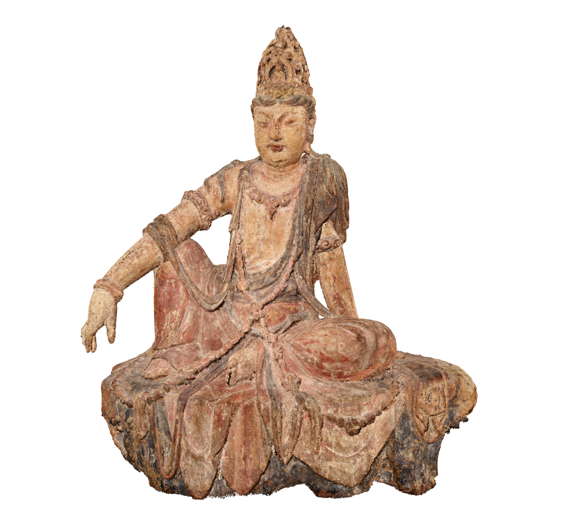
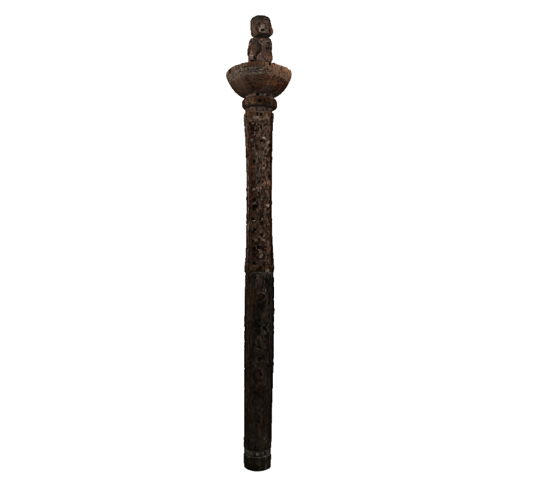
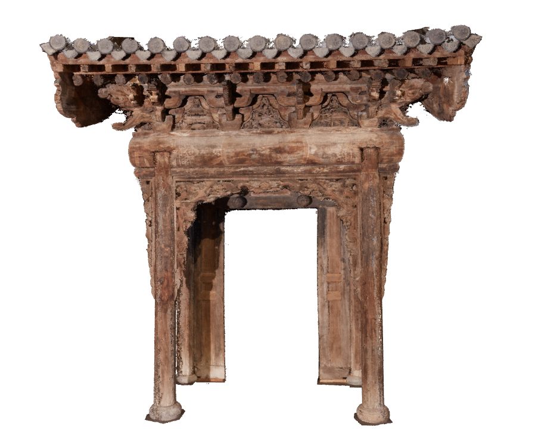

# mia-heritage
MIA-Heritage is a collection of 3 pieces of artwork scanned and provided in the format of point clouds from the Minneapolis Institute of Art. This dataset was collected from point clouds made publicly available through sketchfab.com with the intention of working as a benchmark dataset for point cloud compression technologies.  All credits goes to the Minneapolis Institute of Art . 

The dataset can either be donwloaded in their original format from the links in Table 1 or, or they can be downloaded in .ply format voxilized with a bit depth of 10, see Table 2.

## How to voxilize:

The dataset can be voxlized using the converter.py script

---
```
python3 converter.py --input [path to file or folder] --voxel_bit_depth [integer]

[optional]
--saveVideo saves a video to output/codec/quality/.mp4 it is quite slow to run
--debug (python3 run.py --codec CODEC_HERE --quality QUALITY --debug)
```

## Table 1.

|  Point cloud | No. of points  | License  | Link  |
|---|---|---|---|
| water_moon  | 5,900,000  | CC0 Public Domain  | https://sketchfab.com/3d-models/12th-c-ce-water-moon-guanyin-point-cloud-996ce4d6401445ac9c26f927770df851  | 
| swahili_staff  | 1,100,000  | CC0 Public Domain  | https://sketchfab.com/3d-models/swahili-staff-point-cloud-62ee6bb54f3341e987d70c733ea639bd |
| prosperity_gate  | 6,900,000  | CC Attribution-NonCommercial-ShareAlike  | https://sketchfab.com/3d-models/humility-brings-prosperity-gate-point-cloud-68ba9abd86ea4491918e7b9e6949cb9e |

## Table 2.

|  Point cloud | No. of points  | License  | |
|---|---|---|---|
| water_moon_vox10_0001.ply  | 2,051,364  | CC0 Public Domain  |  |
| swahili_staff_vox10_0001.ply  | 282,629  | CC0 Public Domain  |   |
| prosperity_gate_vox10_0001.ply  | 2,017,477  | CC Attribution-NonCommercial-ShareAlike  |    |
